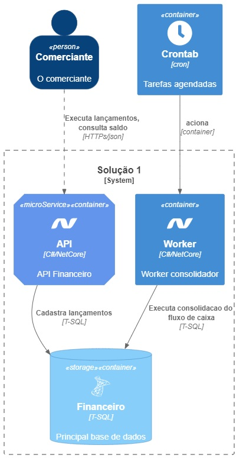
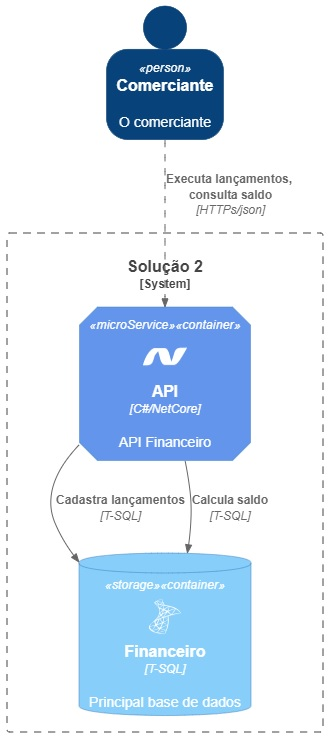

# Financeiro API

## Descrição
Aplicação proposta para o teste MTTECHNE

## Índice <br/>

[Primeira solução](#Primeira-solução)</br>
[Segunda solução](#Segunda-solução)</br>
[Execução da aplicação](#Execução-da-aplicação)<br/>


## Primeira solução ##

A primeira sugestão de implementação leva em consideração um cenário de escalabilidade na adoção de arquitetura de microserviços.

Com a adoção de dois serviços distintos:

Uma API RESTful, este serviço seria responsável por registrar todos os débitos e créditos que o comerciante recebe diariamente, para serem armazenados em um banco de dados. Este serviço também pode ter recursos de validação de dados, para garantir que as informações fornecidas sejam corretas e coerentes. 

Um worker, este serviço seria responsável por consolidar os lançamentos do dia e fornecer um relatório do saldo diário.

Este saldo diário poderia ser então apresentado em um relatório fácil de ler para o comerciante.

Uma abordagem padrão e barata em relação a tempo de desenvolvimento, pode ser desenvolvido como: uma procedure e agendada como um job dentro do banco de dados, que seria executado uma vez por dia, no final do dia, e que coletaria os dados dos lançamentos armazenados no banco de dados e faria a soma dos débitos e créditos para gerar o saldo diário consolidado.

*Atualmente em ambiente on-premisse tenho utilizado um console app, em dois formatos, worker ou cron.*

*Cron é executado sob demanda, em um periodo ou horário pré-determinado, após seu processamento a aplicação é ecerrada assim develvendo os recursos necessários para sua execução, como demonstrado no diagrgama C4 abaixo.*

*Worker este console app fica em execução ouvindo uma fila no RabbitMq (ou outro broker AMPQ), nesta fila ele recebe uma cópia de cada lançamento e faz o calculo do saldo e por fim persiste ele em banco de dados.*

*Abordagens que julgo serem flexíveis no que tange a manutenção e escaláveis, uma vez que podem ter mais de uma instância em execução.*

*Em um ambiente cloud, podemos utilizar processamento de eventos (AWS lambdas ou Azure functions) ao invés de usar console app*

Apesar de não constar como requisito do projeto, torna-se importante habilitar a api para que seja possivel, alterar ou excluir lançamentos, a abordagem do worker torna estas atividades mais faceis de serem adequadas a solução. 




## Segunda solução ##

*Navalha de Occam, é o princípio que prediz que a melhor solução é aquela que apresenta a menor quantidade de premissas possíveis.*
Optei por esta implementação simples, pelo fato do teste não ter a descrição de requisitos arquiteturais como escalabilidade, expectativa de volume de usuários, tempo de performance esperado, e ou como é experado que o comerciante utilize a aplicação, como também as  especificações das regras de negocio, que por sua vez contribuem na condução de uma solução mais deterministica.
Esta foi a solução adotada e codificada para apresentação do teste, uma api monolítica 
simples escrita em .net core que utiliza um banco de dados em memória com EF.
Para controle do saldo utilizei decorator pattern que envolve o command de lançamento, desta forma, a cada lançamento executado faz o calculo do saldo.



## Execução da aplicação ##

Para executar a construção da imagem, execute o seguinte comando na raiz do projeto:

```
docker build --pull --rm -f "Dockerfile" -t financeiro:latest "."
```

Após a conclusão do build, execute o comando abaixo para executar o container.

```
docker run --rm -d -p 8080:80/tcp financeiro:latest
```

Agora que o conteiner está em execução, abra o browser e execute:

http://localhost:8080/swagger/index.html

Agora utilize a api de lançamentos, para criar lançamentos individuais.
Para isso precisa informar o valor e a data do lançamento. 

Para tirar um relatório do consolidado diário utilize a api consolidado.
Ela apresenta a consolidação dos ultimos 30 dias e o valor total do periodo.